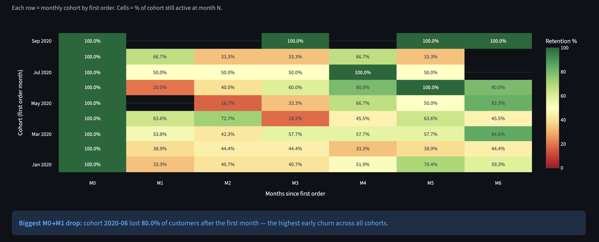
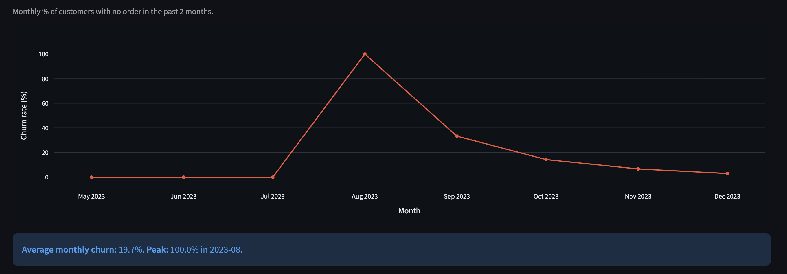
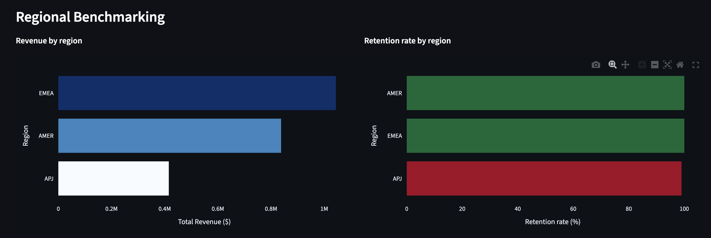
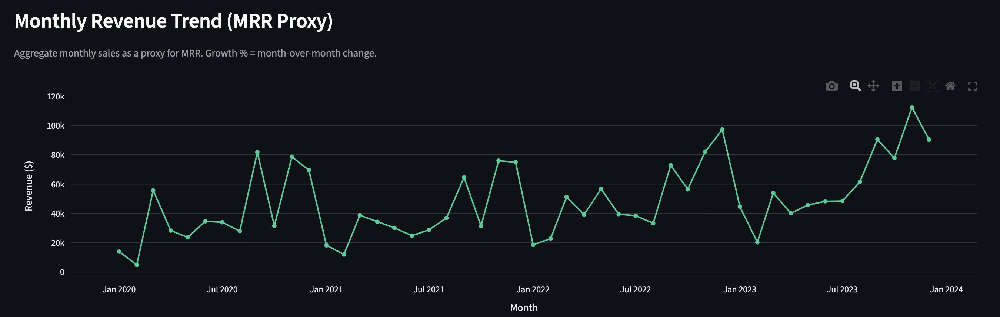

# SaaS Customer Retention & Regional Revenue Analysis

An analyst-style dashboard that answers three core retention questions for a B2B SaaS sales business:

1. **Who retained?** — cohort heatmap showing monthly retention at M0–M6
2. **Who churned?** — implied churn rate trend over time
3. **Where?** — regional benchmarking by revenue, retention rate, and order value

Built with SQL (SQLite) + Python + Streamlit on the [AWS SaaS Sales dataset](https://www.kaggle.com/datasets/nnthanh101/aws-saas-sales).

### Live Demo

**[](https://saas-retention-analysis.streamlit.app/)**

---

## Dashboard

### Cohort Retention Heatmap


### Implied Churn Rate Over Time


### Regional Benchmarking


### Monthly Revenue Trend


---

## Churn Definition

> A customer is **inactive / churned** if they place no order within **N months** of their last purchase, where N = `ceil(median repurchase interval × 2)`.

N is derived from the data itself — not assumed — so the threshold reflects actual buying patterns rather than an arbitrary cutoff. The value is displayed on the dashboard and stored in `outputs/churn_window.csv`.

---

## Project Structure

```
saas-retention-analysis/
├── data/
│   └── saas_sales.csv            # raw Kaggle download (add manually — see below)
├── sql/
│   ├── 01_cohort_retention.sql   # monthly cohort × retention % heatmap data
│   ├── 02_churn_rate.sql         # monthly implied churn rate
│   ├── 03_regional_benchmarks.sql # revenue + retention by region
│   └── 04_revenue_trend.sql      # MRR proxy + MoM growth
├── outputs/                      # generated CSVs (created by pipeline.py)
├── pipeline.py                   # raw CSV → SQLite → runs SQL → writes outputs/
├── dashboard.py                  # Streamlit app
└── requirements.txt
```

---

## Quick Start

### 1. Get the data

Download the dataset from [Kaggle](https://www.kaggle.com/datasets/nnthanh101/aws-saas-sales) and place it at `data/SaaS-Sales.csv`.

### 2. Install dependencies

```bash
pip install -r requirements.txt
```

### 3. Run the pipeline

The `outputs/` folder already contains committed results (so the deployed dashboard works). Delete them first, then regenerate from your own data:

```bash
rm -f outputs/*.csv
python pipeline.py
```

This loads the raw CSV into SQLite, runs all four SQL queries, and writes the results to `outputs/`. The churn window is computed and printed:

```
Churn window: 4 months  (ceil(median_repurchase_interval × 2))
```

### 4. Launch the dashboard

```bash
streamlit run dashboard.py
```

---

## SQL Layer

Each `.sql` file in `sql/` is a standalone, readable query — no ORM, no abstraction. They run against a single `orders` table that mirrors the raw CSV schema.

| File | Output |
|---|---|
| `01_cohort_retention.sql` | Cohort month × month-number retention % |
| `02_churn_rate.sql` | Monthly churn rate (uses `:churn_months` parameter) |
| `03_regional_benchmarks.sql` | Revenue, repeat customers, retention % by region |
| `04_revenue_trend.sql` | Monthly revenue + MoM growth % |

---

## Dashboard Sections

| Section | What it shows |
|---|---|
| **Cohort Retention Heatmap** | Green = retained, red = churned. Steepest row = worst cohort. |
| **Implied Churn Rate** | Monthly churn % trend. Spike = retention event worth investigating. |
| **Regional Benchmarking** | Revenue rank + retention rank side by side. Divergence = opportunity. |
| **Revenue Trend** | MRR proxy with MoM growth %. Acceleration or deceleration visible at a glance. |

---

## Tech Stack

- **SQL / SQLite** — cohort and churn logic lives in `.sql` files
- **Python / Pandas** — pipeline orchestration and churn window computation
- **Plotly** — heatmap, bar charts, line charts
- **Streamlit** — interactive dashboard
